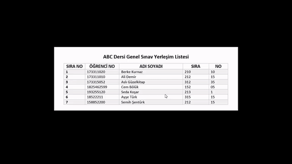

# Yerlesim Plani Bildirici 
Okullarda Gerceklestirilen Sinavlar Icin Ogrencilerin Sinava Girecegi Ve Oturacagi Sira Numarasi Bilgilerini Bildirim Olarak Gonderen Yazilimdir.

### 3 Adımda Sinav Yeri Tespiti
- 1-) Sinav Yeri Fotografi Sisteme Yuklenir
- 2-) Ogrenci Ismini Ve Soyismini Uygulama Icerisine Kaydeder
- 3-) Ogrenciye Ait Sinav Sinifi Ve Sira Numarasi Bildirimi Gonderilir.

### Uygulama Goruntusu

### Bu Proje Neden Var
Okulumuzda Vize Ve Finallerde Yerlesim Yeri Planlari Son 5 Dakika Kala Duvara Asildigi Ve Herkesin Sinav Oncesinde Burada Vakit Kaybettigi Icin Bu Projeyi Gelistirdim.

### Kurulum
- 1-) Bilgisayariniza Projeyi Indirin: git clone https://github.com/berkekurnaz/Yerlesim_Plani_Bildirici.git
- 2-) Npm Paketlerini Kurun: npm install
- 3-) Projeyi Ç
alıştırın: npm start

### Proje Eksikleri
- Uygulama Kapali Halde Iken Gelen Bildirimin Kullanicilara Yonlendirilmesi [X]  
- 3 Isimli Kullanicilarin Isim Parcalama Islemleri Esnasinda Hata Olusmasi [X]

### Kullanim
Oncelikle Backendi 'npm start' diyerek Ayaga Kaldirin.Frontend Icerisinde Yer Alan index.html calistirin ve listeyi buradaki alana yukleyip butona tiklayin. Tarama Isleminin Ardindan Bildirimler Gidecektir.

### Desteklenen Liste Formatlari
- Resim Dosyalari (png, jpg, jpeg)

### Kullanilan Teknolojiler
- Node.Js
- Express.Js
- Tesseract.Js
- Flutter
- Socket.Io

### Lisans
Bu Kelimenin Anlamini Bilmiyorum. Tamamen Ucretsiz Ve Acik Kaynaklidir. Projeye Yaptiginiz Eklemelerden Sonra Pull Request Atmayi Unutmayin.

### Gelistiriciler
Berke Kurnaz  
https://github.com/berkekurnaz

### Iletisim
contact@berkekurnaz.com

